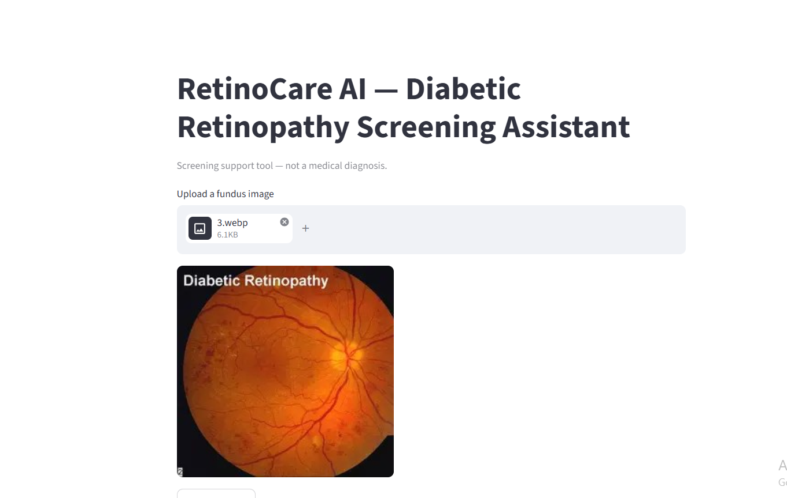
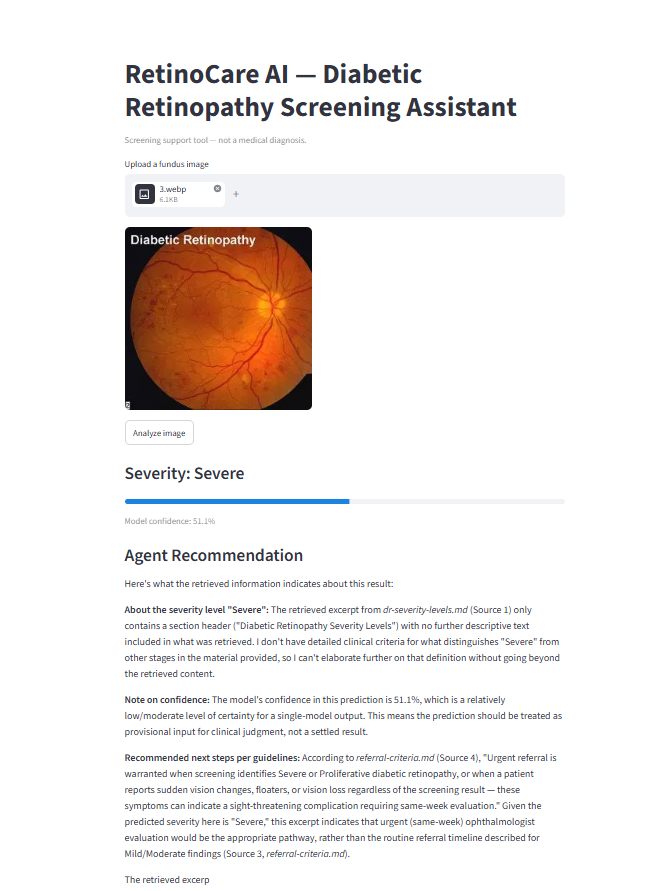
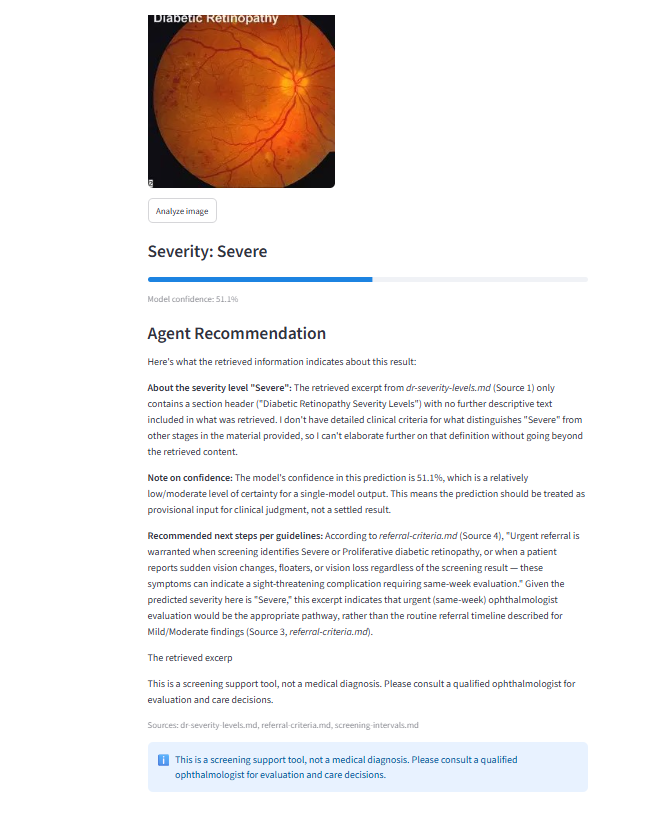

# RetinoCare AI

**An end-to-end diabetic retinopathy screening agent** combining a PyTorch classification pipeline with a retrieval-augmented (RAG) recommendation system — built as a production-oriented portfolio project demonstrating applied ML engineering and agentic AI system design.

> ⚠️ **Not a diagnostic tool.** RetinoCare AI is a screening/triage support system. It never issues a diagnosis and always directs the user to consult a qualified ophthalmologist. This principle is enforced in code, not just documentation 
---

## What this project demonstrates

- **Applied deep learning**: trained and rigorously compared three CNN architectures on real medical imaging data, selecting a production model based on more than raw accuracy
- **Agentic AI system design**: a hybrid-retrieval RAG pipeline grounding LLM output in real source documents, with fail-closed safety guarantees
- **Production engineering discipline**: config-driven training, CI/CD, containerization, a tested API, and a documented model-selection rationale

---

## Live demo

Given a fundus image, the system returns a severity classification, a confidence score, and a guideline-grounded recommendation with citations:

> **Severity: Severe** (confidence: 51.1%)
>
> *"Urgent referral is warranted when screening identifies Severe or Proliferative diabetic retinopathy... this indicates urgent (same-week) ophthalmologist evaluation would be the appropriate pathway."* — cited from `referral-criteria.md`
>
> *This is a screening support tool, not a medical diagnosis. Please consult a qualified ophthalmologist for evaluation and care decisions.*

Note how the agent explicitly flags when its confidence is only moderate ("should be treated as provisional input for clinical judgment, not a settled result") — this is deliberate: the agent's language is grounded in the model's actual confidence score, not generic reassurance.

---

## Architecture

